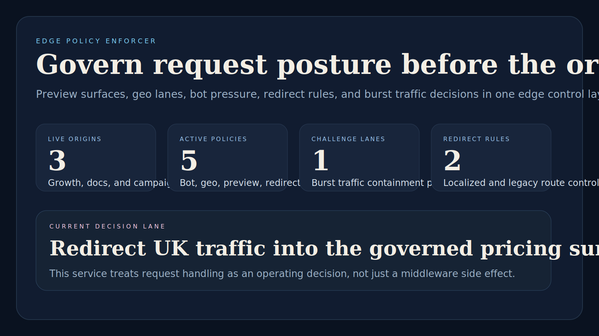
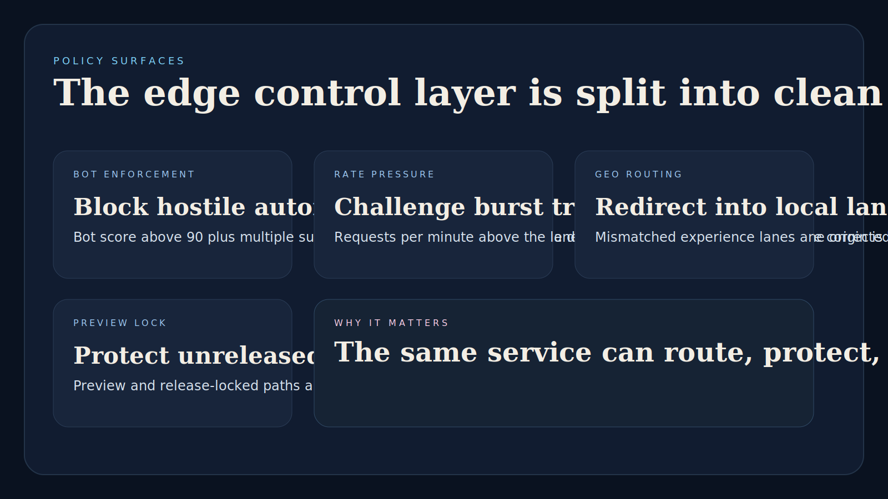
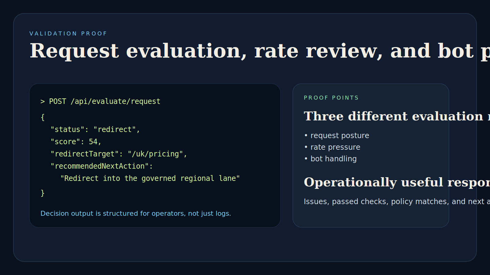

# Edge Policy Enforcer

> **Go platform engineering portfolio project** demonstrating edge request governance, policy evaluation, redirect control, bot handling, geo routing, and traffic-pressure decisions.

**Portfolio takeaway:** *"Platform controls become much more credible when the request-decision layer is treated as a product, not just middleware glue."*

---

## Project Overview

| Attribute | Detail |
|---|---|
| **Language** | Go |
| **HTTP Layer** | `net/http` |
| **Domain** | Edge request governance and policy enforcement |
| **Decision Outputs** | allow · challenge · redirect · deny |
| **Operational Themes** | bot handling · geo routing · preview protection · rate pressure |
| **Artifacts** | dashboard summary · policy inventory · redirect inventory |

---

## Executive Summary

Edge Policy Enforcer models the kind of service platform engineering teams use in front of public origins when request handling needs more nuance than a static CDN rule sheet. Instead of treating edge logic as scattered middleware or a few hard-coded if-statements, the project frames policy enforcement as a centralized control layer that can evaluate risk, route traffic, preserve regional experiences, and protect unreleased surfaces.

The service exposes operational endpoints for policy visibility, evaluates inbound request posture, and returns a clear decision with matched policies, issues, passed checks, and next actions. The repo is designed to feel like infrastructure with product thinking behind it.

---

## Architecture

```text
Inbound request signal
    |
    v
POST /api/evaluate/*
    |
    +--> request posture classification
    +--> bot and burst evaluation
    +--> geo / redirect lane matching
    +--> preview and release lock checks
    |
    v
Operational action
    |
    +--> allow
    +--> challenge
    +--> redirect
    +--> deny
```

### Governance Workflow

1. Edge or gateway systems submit request posture to the policy engine.
2. The engine evaluates preview exposure, bot confidence, traffic pressure, and routing mismatches.
3. Matching policies are attached to the decision response.
4. Operators use `/api/dashboard/summary`, `/api/policies`, `/api/origins`, and `/api/redirect-rules` for visibility into the governed edge surface.

---

## Decision Model

### Request Evaluation

Request scoring covers:

- preview or release-locked access
- bot confidence
- suspicious request signals
- regional experience mismatches
- redirect-rule eligibility
- burst traffic pressure

### Rate Pressure Review

Rate review catches:

- unsafe requests-per-minute levels
- elevated error-rate pressure
- edge saturation risk
- loss of safe prioritization for critical routes

### Bot Decisioning

Bot handling distinguishes:

- normal customer traffic
- challenge-worthy automation
- block-worthy hostile request posture

---

## API Endpoints

| Method | Endpoint | Purpose |
|---|---|---|
| `GET` | `/` | Service index |
| `GET` | `/health` | Service status |
| `GET` | `/api/origins` | List governed origins |
| `GET` | `/api/policies` | List active policies |
| `GET` | `/api/redirect-rules` | List redirect governance rules |
| `GET` | `/api/dashboard/summary` | Operational summary view |
| `POST` | `/api/evaluate/request` | Run full edge request evaluation |
| `POST` | `/api/evaluate/rate-pressure` | Review burst and saturation posture |
| `POST` | `/api/evaluate/bot` | Evaluate automation risk posture |

---

## Sample Request Evaluation

```json
{
  "originId": "growth-site",
  "path": "/pricing",
  "method": "GET",
  "geo": "GB",
  "language": "en-GB",
  "userAgentClass": "browser",
  "botScore": 22,
  "requestsPerMinute": 64,
  "suspiciousSignals": 0,
  "preview": false,
  "releaseLocked": false,
  "expectedExperienceGeo": "US"
}
```

## Sample Response

```json
{
  "status": "redirect",
  "score": 54,
  "riskLevel": "moderate",
  "matchedPolicies": [
    {
      "id": "geo-lane-redirect",
      "name": "Regional experience redirect",
      "category": "geo",
      "action": "redirect",
      "reason": "Route UK visitors into the localized conversion path."
    }
  ],
  "issues": [
    "The incoming experience lane does not match the governed regional surface."
  ],
  "passedChecks": [
    "Origin and path were evaluated against the current policy set."
  ],
  "recommendedNextAction": "Redirect into the governed regional lane and preserve attribution headers.",
  "redirectTarget": "/uk/pricing"
}
```

---

## Screenshots

### Hero Capture



### Policy Surfaces



### Validation Proof



---

## Getting Started

### Prerequisites

- Go 1.22+

### Setup

```bash
git clone https://github.com/mizcausevic-dev/edge-policy-enforcer.git
cd edge-policy-enforcer
go run ./cmd/server
```

Visit:

- `http://localhost:8080/`
- `http://localhost:8080/health`
- `http://localhost:8080/api/dashboard/summary`

### Run Tests

```bash
go test ./...
```

---

## What This Demonstrates

- Go backend breadth beyond the broader TypeScript portfolio layer
- request-governance modeling as a platform capability
- traffic-shaping and bot-handling thinking
- infrastructure-minded API design with clear operational outputs
- policy visibility and controlled redirect governance

---

## Future Enhancements

- signed rule bundles for multi-environment policy promotion
- Redis-backed request counters for live rate enforcement
- per-origin policy overrides with approval workflows
- OpenTelemetry tracing for decision-path observability
- WASM-compatible rule execution for edge deployment targets

---

## Tech Stack

[](https://go.dev/)
[](https://pkg.go.dev/net/http)
[](https://pkg.go.dev/cmd/go#hdr-Test_packages)
[](https://github.com/features/actions)

### Portfolio Links

- [LinkedIn](https://www.linkedin.com/in/mirzacausevic)
- [Kinetic Gain](https://kineticgain.com/)
- [Skills Page](https://mizcausevic.com/skills/)
- [GitHub](https://github.com/mizcausevic-dev)

---

*Part of [mizcausevic-dev's GitHub portfolio](https://github.com/mizcausevic-dev), with a focus on platform engineering, request governance, and infrastructure-grade decision systems.*
